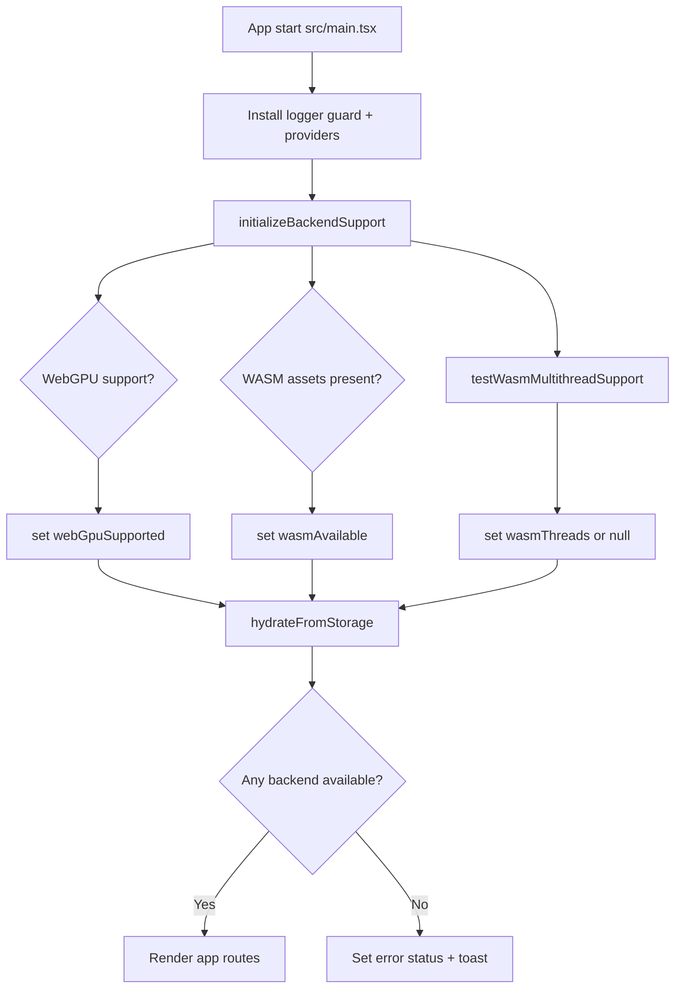
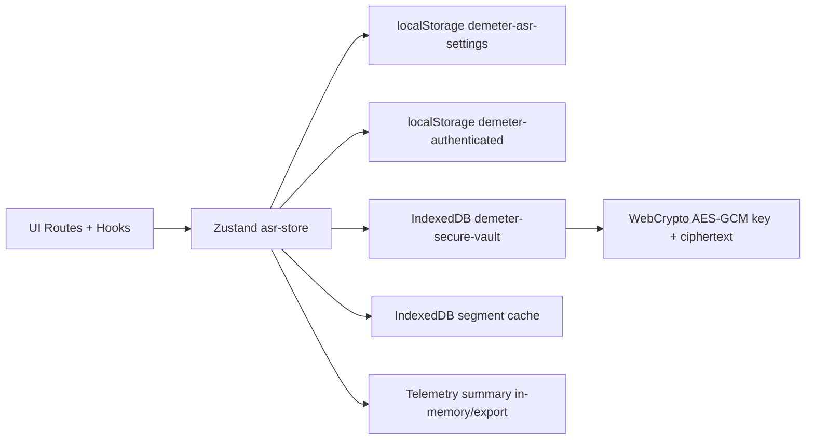

# Architecture

## Overview

Demeter Speech is a React/TypeScript SPA (Vite) organized in layers:

- `src/routes/*`: pages and UI orchestration,
- `src/hooks/*`: application pipelines (transcription, LLM),
- `src/lib/*`: business core (ASR, audio, cloud, LLM, telemetry),
- `src/store/asr-store.ts`: global Zustand state + persistence.

## Main components

| Area | Key file(s) | Responsibility |
| --- | --- | --- |
| Bootstrap | `src/main.tsx` | logger, console guard, backend support init, store hydration |
| Routing | `src/App.tsx` | protected routes, lazy-loaded pages |
| Auth | `src/lib/auth.ts`, `src/routes/LoginPage.tsx` | client-side bcrypt gate |
| Local ASR | `src/hooks/useTranscriptionController.ts` | local full/progressive pipeline |
| Cloud ASR | `src/hooks/useCloudTranscription.ts` | Gradio/Whisper/Mistral cloud pipeline |
| Speaker mapping | `src/lib/speakerAssignments.ts` | speaker id collection + assigned label resolution |
| Speaker assignment UI | `src/components/results/SpeakerAssignmentDialog.tsx` | first/last-name assignment dialog per speaker |
| LLM cloud | `src/hooks/useLlmReports.ts` | CRI/CRO/CRS/CRN generation via APIs and backend queues |
| LLM local | `src/hooks/useLlmLocalReports.ts` | browser-side report generation |
| Runtime backend | `src/lib/backend-support.ts`, `src/lib/asr.ts` | WebGPU/WASM detection, fallback, thread policy |
| Settings persistence | `src/lib/storage.ts`, `src/store/asr-store.ts` | localStorage without secrets |
| Secret vault | `src/lib/secure-token-vault.ts` | encrypted token storage in IndexedDB |
| Telemetry | `src/lib/telemetry.ts` | events, timers, memory snapshots, export |

## Diagram: startup and backend selection

## Application routing

Main routes:

- `/login`: authentication.
- `/localupload`: local transcription.
- `/cloudupload`: cloud transcription.
- `/llmlocal`: local report generation.
- `/llmapi`: cloud report generation.
- `/settings`: configuration panel.
- `/telemetry`: telemetry cockpit.

All business routes are wrapped by `RequireAuth`.

## Global state and data flow

- Single store: `useAsrStore`.
- Startup hydration via `loadSettings()`.
- Reactive persistence via `useAsrStore.subscribe(...)`.
- Secrets (`hfApiToken`, `mistralApiKey`) are excluded from `demeter-asr-settings`.
- `runExportHeaders` and `speakerAssignments` are runtime session-only state (not persisted in `PersistedSettings`).
- Backend-mode queues for activity and performance telemetry are persisted in IndexedDB so events survive a refresh until the backend session can flush them.

## Diagram: persistence map

## Observability

- Structured telemetry events (`TelemetryCollector`).
- Phase timers (`startTimer`/`stopTimer`).
- Fallback alerts (`recordAlert`).
- Memory snapshots (`snapshotMemory`) on critical stages.

## Next documents

- Local pipeline: [`local-transcription.md`](local-transcription.md)
- Cloud pipeline: [`cloud-transcription.md`](cloud-transcription.md)
- Cloud LLM pipeline: [`llm-cloud.md`](llm-cloud.md)
- Local LLM pipeline: [`llm-local.md`](llm-local.md)
