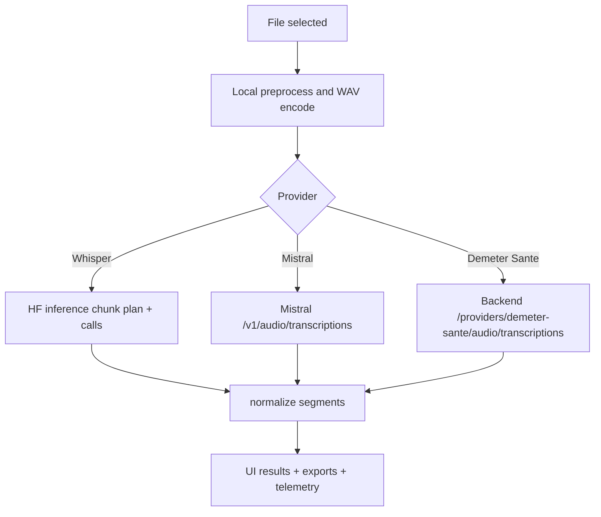

# Cloud transcription

## Scope

Route: `/cloudupload`

The module applies local preprocessing then delegates transcription to a remote provider.

Supported providers:

- Hugging Face Whisper,
- Mistral audio transcription,
- Demeter Sante backend transcription.

## Shared pipeline

1. File selection + metadata.
2. Effective settings resolution from persisted cloud settings.
3. Local preprocessing (`preprocessCloudAudio`).
4. WAV encoding.
5. Provider submit.
6. Output parsing into normalized segments.
7. Result export.

## Diagram: cloud pipeline by provider

## Provider differences

### Whisper (Hugging Face)

- HF token required.
- Whisper-specific cloud chunking (`cloudWhisperChunkDurationSec`, `cloudWhisperOverlapSec`).

### Mistral

- Mistral API key required.
- Endpoint: `${cloudMistralApiUrl}/v1/audio/transcriptions`.
- Mistral-specific chunking (`cloudMistralChunkDurationSec`, `cloudMistralOverlapSec`) is applied before upload.
- Voxtral chunks are capped to 15 minutes, then split again automatically on size overflow or upstream timeout.
- Diarization configurable (`cloudMistralDiarizationEnabled`).
- Retry without diarization on validation error 422.

### Demeter Sante

- Uses the backend provider route on `/api/v1/providers/demeter-sante/audio/transcriptions`.
- Reuses the Mistral parsing pipeline and diarization handling.
- Reuses the same Mistral chunking settings and timeout fallback split strategy.
- Does not require a client-side Mistral API key.

## Runtime states

`CloudStatus` values:

- `idle`,
- `preprocessing`,
- `uploading`,
- `transcribing`,
- `stopping`,
- `done`,
- `error`.

UI exposes progress, status detail, stop/reset controls.

## Stop and reset

- Stop marks the current client run as cancelled.
- Reset invalidates current run, waits for stop, then clears cloud session state.

## Cloud exports

Configurable independently from local mode:

- segment visibility,
- VTT/SRT/JSON/telemetry exports.

Cloud placement and defaults:

- on `/cloudupload`, export buttons are rendered above segments (right after `AudioPlayer`),
- cloud defaults for new profiles: `VTT`, `SRT`, `JSON` visible and `Telemetry` hidden,
- cloud toggles stay independent from local toggles.

Export header (run snapshot):

- built from `runExportHeaders.cloud` (effective settings used by the run),
- provider-specific without parameter mixing:
  - Whisper: whisper chunking + whisper/cloud preprocess fields (context not sent),
  - Mistral: endpoint/model/chunking + requested/effective diarization/fallback chunks,
  - Demeter Sante: backend-provider model + requested/effective diarization/fallback chunks.

## Speakers and diarization in UI

Display:

- the table `Speaker` column is shown when at least one segment contains speaker data,
- it is no longer strictly tied to the diarization toggle alone.

Assignment:

- the `Assigner speakers` button is shown only when speakers are detected in segments,
- applied assignments (first/last names) are reflected in the table and `VTT`/`SRT`/`JSON` exports.
- on `/cloudupload`, clicking a segment's text opens a local text editor,
- changes are applied to the current session and reflected in exports and reports,
- editing stays disabled while transcription is active to avoid collisions with new segments.

Known limitation:

- if Mistral returns `422` and auto-falls back without diarization, segments can be produced without speaker data.

## Related implementation files

- `src/hooks/useCloudTranscription.ts`
- `src/lib/cloud/preprocessCloudAudio.ts`
- `src/lib/cloud/whisperClient.ts`
- `src/lib/cloud/mistralClient.ts`
