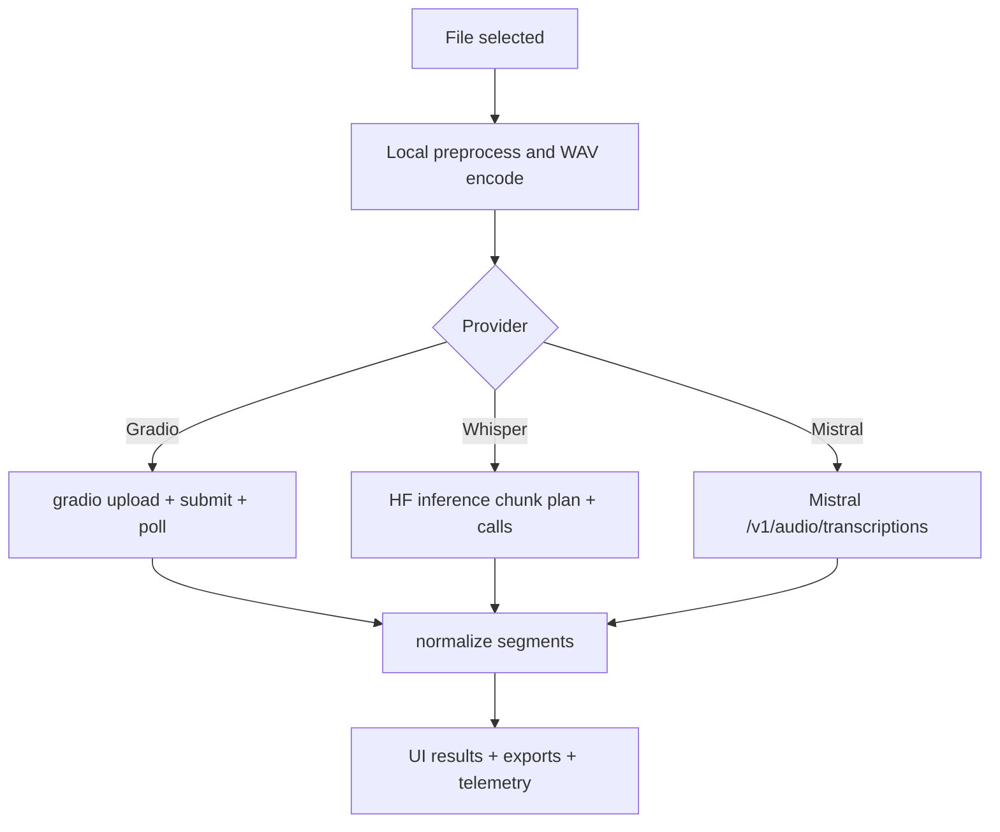

# Cloud transcription

## Scope

Route: `/cloudupload`

The module applies local preprocessing then delegates transcription to a remote provider.

Supported providers:

- Gradio,
- Hugging Face Whisper,
- Mistral audio transcription.

## Shared pipeline

1. File selection + metadata.
2. Session settings resolution (`resolveCloudSessionSettings`).
3. Local preprocessing (`preprocessCloudAudio`).
4. WAV encoding.
5. Provider upload/submit.
6. Output parsing into normalized segments.
7. Result export.

## Diagram: cloud pipeline by provider

## Provider differences

### Gradio

- Default URL: `https://transcode.demeter-sante.fr/gradio`.
- Context text is used (preset + session context).
- May return SRT/text payloads to parse.

### Whisper (Hugging Face)

- HF token required.
- Whisper-specific cloud chunking (`cloudWhisperChunkDurationSec`, `cloudWhisperOverlapSec`).
- Custom context is currently ignored (explicit telemetry marker).

### Mistral

- Mistral API key required.
- Endpoint: `${cloudMistralApiUrl}/v1/audio/transcriptions`.
- Mistral-specific chunking (`cloudMistralChunkDurationSec`, `cloudMistralOverlapSec`).
- Diarization configurable (`cloudMistralDiarizationEnabled`).
- Retry without diarization on validation error 422.

## Context handling

- Effective context = settings preset + session context.
- Context is sent only in Gradio flows.
- Whisper/Mistral log a context-ignored event when context exists.

## Runtime states

`CloudStatus` values:

- `idle`,
- `preprocessing`,
- `uploading`,
- `transcribing`,
- `stopping`,
- `done`,
- `error`.

UI exposes progress, status detail, stop/reset controls.

## Stop and reset

- Stop attempts provider-side cancellation (notably Gradio stop flag).
- Reset invalidates current run, waits for stop, then clears cloud session state.

## Cloud exports

Configurable independently from local mode:

- segment visibility,
- VTT/SRT/JSON/telemetry exports.

## Related implementation files

- `src/hooks/useCloudTranscription.ts`
- `src/lib/cloud/preprocessCloudAudio.ts`
- `src/lib/cloud/gradioClient.ts`
- `src/lib/cloud/whisperClient.ts`
- `src/lib/cloud/mistralClient.ts`
- `src/lib/cloud/sessionSettings.ts`
