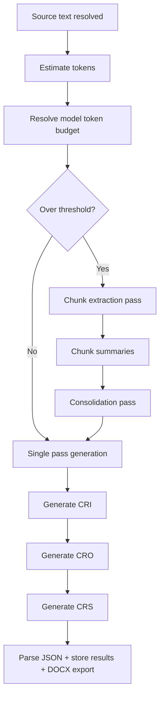

# LLM Cloud (CRI/CRO/CRS reports)

## Scope

Route: `/llmapi`

Generation of three report formats:

- `CRI` (high-fidelity),
- `CRO` (structured rewrite),
- `CRS` (short synthesis).

Once the cloud response comes back, each report can be edited in `/llmapi` for the current session. A refresh restores the original cloud version.

Providers:

- Hugging Face,
- Mistral.

## Input sources

- session transcription (`segments`),
- free text,
- file import from `.txt`, `.srt`, `.vtt`, `.json`.

Import parsing ensures robust transcript extraction (`parseTranscriptFile`).

## Long-input strategy

When source size exceeds model context budget, a two-pass strategy is used.

## Diagram: LLM long-input pipeline

## Provider rules

### Hugging Face

- HF token required,
- `chatCompletion` first, then `textGeneration` fallback when needed,
- exponential retries on transient failures.

### Mistral

- API key required,
- model metadata fetched from `/v1/models` to adjust max tokens,
- generation through chat completions endpoint,
- progressive `max_tokens` reduction when context limit errors occur.

## Multi-format orchestration

Fixed order:

1. CRI,
2. CRO,
3. CRS.

Each format is parsed into structured JSON (`reportSchema`) and stored in `llmApiResults`.

## DOCX export

- one document per format,
- filename pattern: `rapport-<format>-YYYY-MM-DD-HHmm.docx`,
- embedded metadata: model, timestamp, source mode, source tokens.
- export always uses the current edited version of the report.

## Runtime states

`LlmApiStatus`:

- `idle`,
- `preparing`,
- `generating`,
- `formatting`,
- `done`,
- `error`.

Global progress is visible in page UI and topbar.

## Key parameters

- active provider (`llmApiProvider`),
- provider-specific model id/temperature/max tokens,
- HF token and Mistral key (stored in secure vault).

## Related implementation files

- `src/hooks/useLlmReports.ts`
- `src/lib/llm/providerSettings.ts`
- `src/lib/llm/modelCatalog.ts`
- `src/lib/llm/reportService.ts`
- `src/lib/llm/hfClient.ts`
- `src/lib/llm/mistralChatClient.ts`
- `src/lib/docx/reportDocx.ts`
