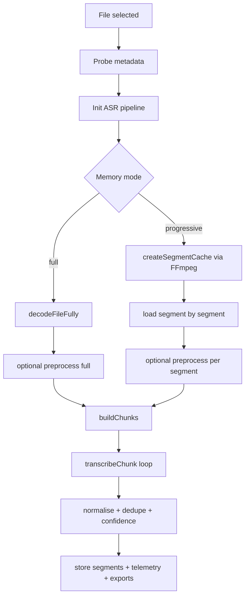

# Local transcription

## Scope

Route: `/localupload`

Browser-local execution through Transformers.js ASR + ONNX Runtime Web.

## Functional pipeline

1. File selection (`AudioUploader`).
2. Metadata probe (`probeAudioMetadata`).
3. ASR pipeline initialization (`createAsrPipeline`).
4. Audio preprocessing (`quick` or `full`).
5. Chunk plan build (`buildChunks`).
6. Chunk-by-chunk transcription (`transcribeChunk`).
7. Inter-chunk text normalization + dedup.
8. Segment/global confidence computation.
9. Exports (`VTT`, `SRT`, `JSON`, `telemetry.json`).

## Diagram: local full vs progressive pipeline

## Runtime backend and fallback

Logical order:

- `webgpu` preference then `wasm` fallback,
- WASM asset validation,
- WASM multithread test,
- single-thread fallback when multithread init fails.

Visible indicators:

- `activeBackend`,
- WASM single-thread/multithread badge,
- status/detail messages in topbar and status bar.

## Memory modes

### `full` mode

- full decode into RAM,
- simpler for short/medium files,
- higher memory pressure.

### `progressive` mode

- upstream segmentation with FFmpeg WASM,
- intermediate segment cache in IndexedDB,
- incremental decode/transcribe,
- robust for long media.

## Chunking and segmentation

Strategies:

- `sequential`: fixed windows,
- `overlap`: overlapping windows + dedup,
- `silence`: VAD/silence-aware segmentation.

Main parameters:

- `chunkDurationSec`,
- `overlapSec`,
- `silenceThresholdDb`,
- `minSilenceMs`,
- `minChunkMs`, `maxChunkMs`.

## Audio preprocessing

Primary controls:

- denoise (noise floor, reduction, smoothing),
- high-pass / low-pass filters,
- LUFS normalization,
- limiter,
- VAD,
- overlap-add smoothing,
- autotune.

`full` mode enables heavy processing. `quick` skips heavy steps.

## Confidence and quality

- segment confidence (`confidence`) when model returns it,
- duration-weighted global confidence,
- text-based fallback estimation when model confidence is unavailable.

## Stop, abort, errors

- Stop button requests graceful stop,
- immediate abort through shared controller,
- local session reset keeps persisted settings,
- temporary error hold before auto-reset.

## Exports and run snapshot

On `/localupload`, the `ExportButtons` block is rendered above the segment table (right after the audio player).

Local defaults:

- `VTT`, `SRT`, `JSON` visible,
- `telemetry` hidden.

Supported exports remain:

- `VTT` transcription,
- `SRT` transcription,
- segment `JSON`,
- `telemetry.json`.

Export headers are built from the run snapshot first (`runExportHeaders.upload`), captured when transcription starts:

- effective settings used for that run (effective memory mode, chunking, preprocessing, timestamp/confidence options),
- effective runtime values (run id, file metadata, active backend, active model).

If no snapshot exists, a fallback uses current settings.

## Speakers and assignment

The segment table automatically shows the `Speaker` column when at least one segment has speaker data.

When speakers are available:

- the `Assigner speakers` button is shown,
- a dialog lets you set `Last name` and `First name` for each technical speaker id,
- the displayed label becomes `Last name First name` (without technical id) in the table.

Assignments are:

- session-only (not persisted),
- scoped per mode (`upload`, `mic`, `cloud`),
- cleared on new run, session/app reset, or reload.

Speaker export impact:

- `VTT`/`SRT`: inline prefix `Speaker: text`,
- `JSON`: `speaker` field rewritten with the assigned label,
- `telemetry.json`: unchanged.

## Related implementation files

- `src/hooks/useTranscriptionController.ts`
- `src/lib/asr.ts`
- `src/lib/preprocessing.ts`
- `src/lib/chunking.ts`
- `src/lib/export.ts`
