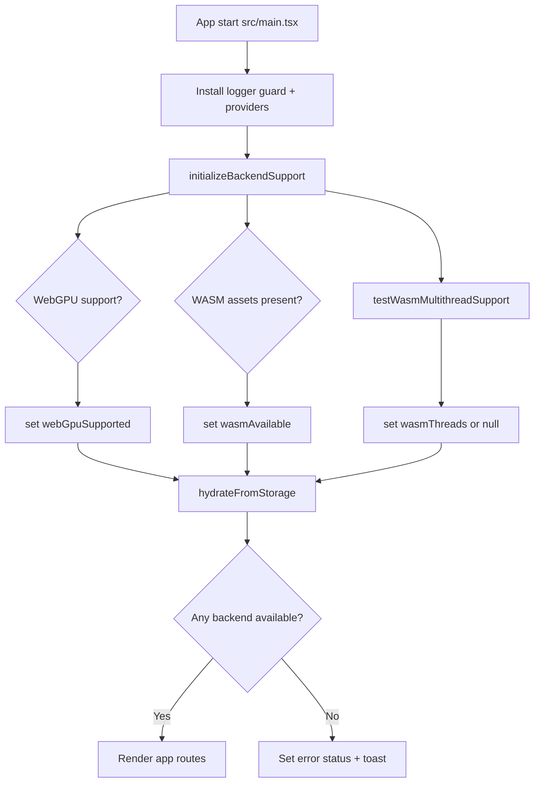
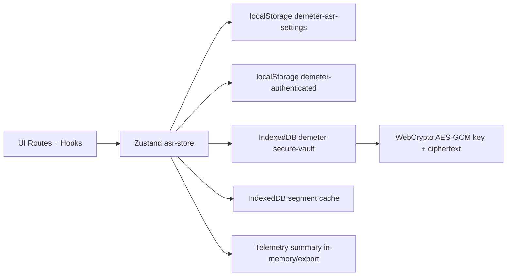

# Architecture

## Vue d ensemble

Demeter Speech est une SPA React/TypeScript (Vite) organisee en couches:

- `src/routes/*`: pages et orchestration UI,
- `src/hooks/*`: pipelines applicatifs (transcription, LLM),
- `src/lib/*`: coeur metier (ASR, audio, cloud, LLM, telemetry),
- `src/store/asr-store.ts`: etat global Zustand + persistance.

## Composants majeurs

| Zone | Fichier(s) cle(s) | Role |
| --- | --- | --- |
| Bootstrap | `src/main.tsx` | logger, guard console, support backend, hydration store |
| Routing | `src/App.tsx` | routes protegees, lazy loading pages |
| Auth | `src/lib/auth.ts`, `src/routes/LoginPage.tsx` | gate client-side par hash bcrypt |
| Local ASR | `src/hooks/useTranscriptionController.ts` | pipeline local full/progressive |
| Cloud ASR | `src/hooks/useCloudTranscription.ts` | pipeline providers Gradio/Whisper/Mistral |
| Speaker mapping | `src/lib/speakerAssignments.ts` | collecte IDs speaker + resolution labels assignes |
| Speaker assignment UI | `src/components/results/SpeakerAssignmentDialog.tsx` | modal d assignation nom/prenom par speaker |
| LLM cloud | `src/hooks/useLlmReports.ts` | generation CRI/CRO/CRS via APIs |
| LLM local | `src/hooks/useLlmLocalReports.ts` | generation locale avec pipeline text-generation |
| Runtime backend | `src/lib/backend-support.ts`, `src/lib/asr.ts` | detection WebGPU/WASM, fallback et thread policy |
| Persistance settings | `src/lib/storage.ts`, `src/store/asr-store.ts` | localStorage sans secrets |
| Vault secrets | `src/lib/secure-token-vault.ts` | stockage token chiffre AES-GCM en IndexedDB |
| Telemetrie | `src/lib/telemetry.ts` | events, timers, snapshots memoire, export |

## Diagramme: startup et selection runtime backend

## Routing applicatif

Routes principales:

- `/login`: authentification.
- `/localupload`: transcription locale.
- `/cloudupload`: transcription cloud.
- `/llmlocal`: generation rapports locale.
- `/llmapi`: generation rapports cloud.
- `/settings`: panneau de configuration.
- `/telemetry`: cockpit telemetrie.

Toutes les routes metier sont protegees par `RequireAuth`.

## Etat global et flux de donnees

- Store unique: `useAsrStore`.
- Hydratation au bootstrap avec `loadSettings()`.
- Sauvegarde reactive via `useAsrStore.subscribe(...)`.
- Les secrets (`hfApiToken`, `mistralApiKey`) ne sont pas serialises dans `demeter-asr-settings`.
- `runExportHeaders` et `speakerAssignments` sont des etats runtime session-only (non persistes dans `PersistedSettings`).

## Diagramme: carte de persistance

## Observabilite

- Evenements telemetrie structures (`TelemetryCollector`).
- Timers de phase (`startTimer`/`stopTimer`).
- Alerts de fallback (`recordAlert`).
- Snapshots memoire (`snapshotMemory`) sur points critiques.

## Naviguer vers les pipelines

- Pipeline local: [`local-transcription.md`](local-transcription.md)
- Pipeline cloud: [`cloud-transcription.md`](cloud-transcription.md)
- Pipeline LLM cloud: [`llm-cloud.md`](llm-cloud.md)
- Pipeline LLM local: [`llm-local.md`](llm-local.md)
