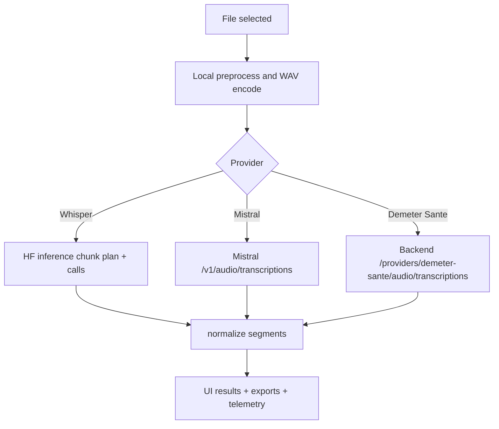

# Transcription cloud

## Scope

Route: `/cloudupload`

Le module applique un pretraitement local puis delegue la transcription a un provider distant.

Providers supportes:

- Hugging Face Whisper,
- Mistral audio transcription,
- transcription backend Demeter Sante.

## Pipeline commun

1. Selection fichier + metadata.
2. Resolution des settings cloud persistants.
3. Pretraitement local (`preprocessCloudAudio`).
4. Encodage WAV.
5. Appel provider.
6. Parsing sortie en segments normalises.
7. Export des resultats.

## Diagramme: pipeline cloud par provider

## Differences provider

### Whisper (Hugging Face)

- Token HF requis.
- Chunking cloud specifique whisper (`cloudWhisperChunkDurationSec`, `cloudWhisperOverlapSec`).

### Mistral

- Cle API Mistral requise.
- Endpoint: `${cloudMistralApiUrl}/v1/audio/transcriptions`.
- Chunking cloud specifique mistral (`cloudMistralChunkDurationSec`, `cloudMistralOverlapSec`) applique avant l envoi.
- Les chunks Voxtral sont plafonnes a 15 minutes, puis redecoupes automatiquement si la taille depasse la limite ou si l upstream time out.
- Diarization configurable (`cloudMistralDiarizationEnabled`).
- Retry sans diarization en cas d erreur validation 422.

### Demeter Sante

- Utilise la route backend `/api/v1/providers/demeter-sante/audio/transcriptions`.
- Reutilise le parsing Mistral et la gestion de la diarization.
- Reutilise aussi les memes reglages de chunking Mistral et le redecoupage automatique sur timeout.
- Ne demande pas de cle API Mistral cote navigateur.

## Etats runtime

`CloudStatus`:

- `idle`,
- `preprocessing`,
- `uploading`,
- `transcribing`,
- `stopping`,
- `done`,
- `error`.

L UI expose progression, detail status, et bouton stop/reset session.

## Stop et reset

- Stop marque le run client courant comme annule.
- Reset invalide run courant, attend arret, puis purge etat session cloud.

## Exports cloud

Configurable independamment du local:

- affichage segments,
- export VTT/SRT/JSON/telemetry.

Positionnement et defaults cloud:

- sur `/cloudupload`, les boutons d export sont places au-dessus des segments (juste apres `AudioPlayer`),
- defaults cloud sur nouveau profil: `VTT`, `SRT`, `JSON` visibles et `Telemetry` masque,
- les toggles cloud restent independants des toggles local.

Header d export (run snapshot):

- construit depuis `runExportHeaders.cloud` (settings effectivement utilises pendant le run),
- provider-specifique sans melange de parametres:
  - Whisper: chunking whisper + options whisper/preprocess cloud (pas de contexte envoye),
  - Mistral: endpoint/model/chunking + diarization demandee/effective/fallback chunks,
  - Demeter Sante: provider backend + diarization demandee/effective/fallback chunks.

## Speakers et diarization en UI

Affichage:

- la colonne `Speaker` du tableau apparait si au moins un segment contient un speaker,
- elle n est plus strictement conditionnee au toggle diarization UI.

Assignation:

- le bouton `Assigner speakers` apparait seulement si des speakers sont detectes dans les segments,
- les assignations appliquees (nom/prenom) se refletent dans la table et les exports `VTT`/`SRT`/`JSON`.
- sur `/cloudupload`, cliquer sur le texte d'un segment ouvre une edition locale du texte,
- les modifications sont appliquees a la session en cours et se refletent dans les exports et les rapports,
- l'edition reste desactivee pendant une transcription active pour eviter les collisions avec de nouveaux segments.

Limitation connue:

- si Mistral retourne `422` et fallback automatique sans diarization, des segments peuvent etre produits sans speaker.

## Fichiers techniques lies

- `src/hooks/useCloudTranscription.ts`
- `src/lib/cloud/preprocessCloudAudio.ts`
- `src/lib/cloud/whisperClient.ts`
- `src/lib/cloud/mistralClient.ts`
