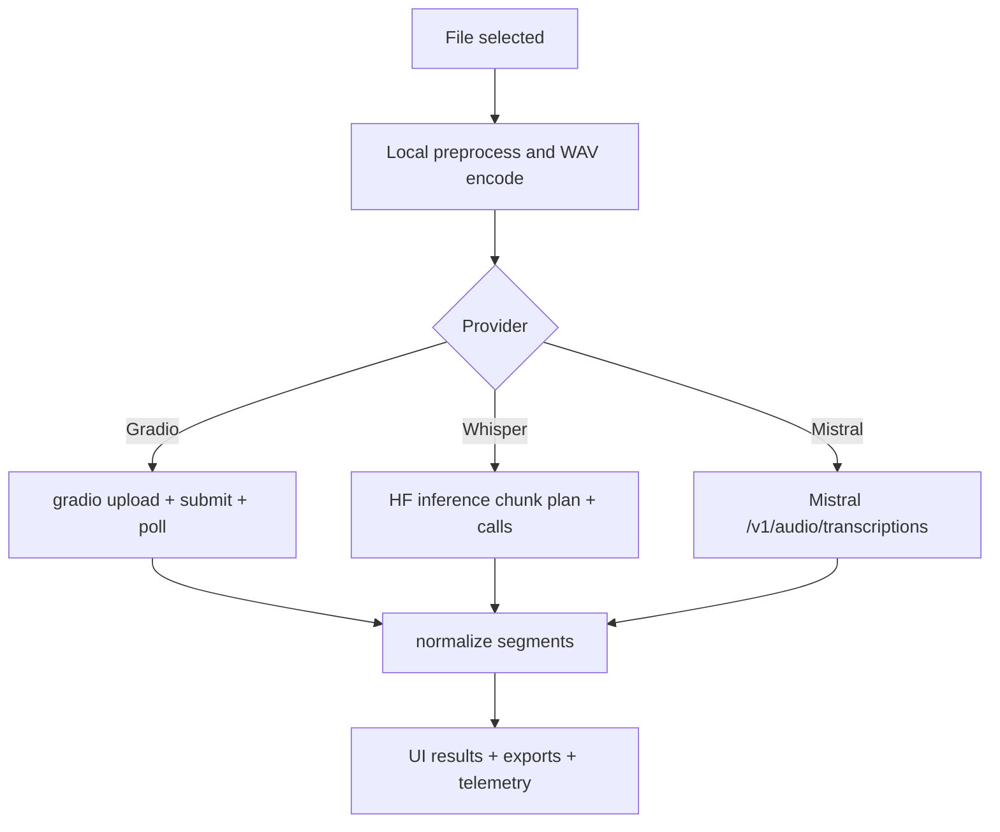

# Transcription cloud

## Scope

Route: `/cloudupload`

Le module applique un pretraitement local puis delegue la transcription a un provider distant.

Providers supportes:

- Gradio,
- Hugging Face Whisper,
- Mistral audio transcription.

## Pipeline commun

1. Selection fichier + metadata.
2. Resolution settings de session (`resolveCloudSessionSettings`).
3. Pretraitement local (`preprocessCloudAudio`).
4. Encodage WAV.
5. Upload/submit provider.
6. Parsing sortie en segments normalises.
7. Export des resultats.

## Diagramme: pipeline cloud par provider

## Differences provider

### Gradio

- URL par defaut: `https://transcode.demeter-sante.fr/gradio`.
- Contexte texte utilise (preset + session context).
- Peut retourner SRT/texte a parser.

### Whisper (Hugging Face)

- Token HF requis.
- Chunking cloud specifique whisper (`cloudWhisperChunkDurationSec`, `cloudWhisperOverlapSec`).
- Contexte custom actuellement ignore (trace telemetrie explicite).

### Mistral

- Cle API Mistral requise.
- Endpoint: `${cloudMistralApiUrl}/v1/audio/transcriptions`.
- Chunking cloud specifique mistral (`cloudMistralChunkDurationSec`, `cloudMistralOverlapSec`).
- Diarization configurable (`cloudMistralDiarizationEnabled`).
- Retry sans diarization en cas d erreur validation 422.

## Gestion du contexte

- Contexte effectif = preset settings + contexte session.
- Contexte envoye uniquement pour Gradio.
- Whisper/Mistral loggent un event "context ignored" quand du contexte existe.

## Etats runtime

`CloudStatus`:

- `idle`,
- `preprocessing`,
- `uploading`,
- `transcribing`,
- `stopping`,
- `done`,
- `error`.

L UI expose progression, detail status, et bouton stop/reset session.

## Stop et reset

- Stop tente un arret provider (notamment flag Gradio).
- Reset invalide run courant, attend arret, puis purge etat session cloud.

## Exports cloud

Configurable independamment du local:

- affichage segments,
- export VTT/SRT/JSON/telemetry.

Positionnement et defaults cloud:

- sur `/cloudupload`, les boutons d export sont places au-dessus des segments (juste apres `AudioPlayer`),
- defaults cloud sur nouveau profil: `VTT`, `SRT`, `JSON` visibles et `Telemetry` masque,
- les toggles cloud restent independants des toggles local.

Header d export (run snapshot):

- construit depuis `runExportHeaders.cloud` (settings effectivement utilises pendant le run),
- provider-specifique sans melange de parametres:
  - Gradio: endpoint + generation/context/preprocess cloud,
  - Whisper: chunking whisper + options whisper/preprocess cloud (pas de contexte envoye),
  - Mistral: endpoint/model/chunking + diarization demandee/effective/fallback chunks.

## Speakers et diarization en UI

Affichage:

- la colonne `Speaker` du tableau apparait si au moins un segment contient un speaker,
- elle n est plus strictement conditionnee au toggle diarization UI.

Assignation:

- le bouton `Assigner speakers` apparait seulement si des speakers sont detectes dans les segments,
- les assignations appliquees (nom/prenom) se refletent dans la table et les exports `VTT`/`SRT`/`JSON`.

Limitation connue:

- si Mistral retourne `422` et fallback automatique sans diarization, des segments peuvent etre produits sans speaker.

## Fichiers techniques lies

- `src/hooks/useCloudTranscription.ts`
- `src/lib/cloud/preprocessCloudAudio.ts`
- `src/lib/cloud/gradioClient.ts`
- `src/lib/cloud/whisperClient.ts`
- `src/lib/cloud/mistralClient.ts`
- `src/lib/cloud/sessionSettings.ts`
