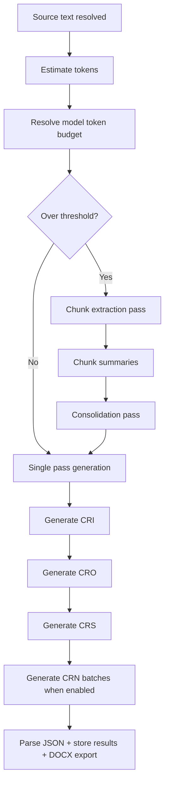

# LLM Cloud (rapports CRI/CRO/CRS)

## Scope

Route: `/llmapi`

Generation de quatre formats de compte rendu:

- `CRI` (fidele),
- `CRO` (structure),
- `CRS` (synthese),
- `CRN` (narratif chronologique, genere par lots de transcription).

Une fois la reponse cloud retournee, chaque compte rendu est editable dans `/llmapi` pour la session en cours. Un rafraichissement remet la version originale du cloud.

Providers:

- Hugging Face,
- Mistral,
- Demeter Sante via la queue backend de report operations.

## Sources d entree

- transcription session (`segments`),
- texte libre,
- import de fichiers `.txt`, `.srt`, `.vtt`, `.json`.

Parsing import assure extraction robuste de texte transcrit (`parseTranscriptFile`).

## Pipeline long input

Si la source depasse le budget contexte modele, Hugging Face et Mistral directs utilisent une preparation 2 passes. Demeter Sante envoie la source a la queue backend sans utiliser l ancien proxy frontend chat-completions.

## Diagramme: pipeline long input LLM

## Regles provider

### Hugging Face

- token HF requis,
- strategie `chatCompletion` avec fallback `textGeneration` selon modele/provider,
- retries exponentiels sur erreurs transientes.

### Mistral

- cle API requise,
- metadata modeles recuperee via `/v1/models` pour ajuster max tokens,
- generation via endpoint chat completions,
- reduction progressive `max_tokens` en cas erreur limite contexte.

### Demeter Sante

- session backend requise,
- generation de rapport soumise a `/providers/demeter-sante/report/operations`,
- progression pollee via `/providers/demeter-sante/report/operations/:operationId`,
- aucun appel frontend direct a `/providers/demeter-sante/chat/completions`.

## Orchestration multi-formats

Ordre UI stable:

1. CRI,
2. CRO,
3. CRS,
4. CRN.

Chaque format est parse en JSON structure (`reportSchema`) puis stocke dans `llmApiResults`.

## Export DOCX

- un document par format,
- nommage: `rapport-<format>-YYYY-MM-DD-HHmm.docx`,
- metadata incluse: modele, date, mode source, tokens source.
- l'export utilise toujours la version editee courante du compte rendu.

## Etats runtime

`LlmApiStatus`:

- `idle`,
- `preparing`,
- `generating`,
- `formatting`,
- `done`,
- `error`.

Progression globale exposee dans UI et topbar.

## Parametres importants

- provider actif (`llmApiProvider`),
- model id/temperature/max tokens par provider,
- token HF et cle Mistral (stockage securise via vault).

## Fichiers techniques lies

- `src/hooks/useLlmReports.ts`
- `src/lib/llm/providerSettings.ts`
- `src/lib/llm/modelCatalog.ts`
- `src/lib/llm/reportService.ts`
- `src/lib/llm/hfClient.ts`
- `src/lib/llm/mistralChatClient.ts`
- `src/lib/docx/reportDocx.ts`
