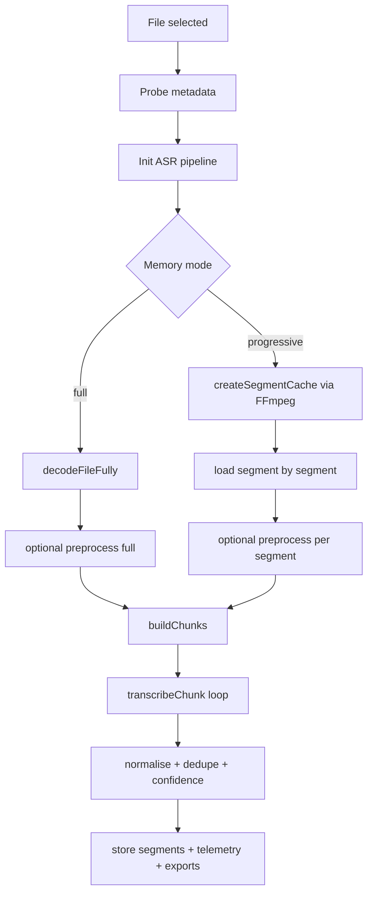

# Transcription locale

## Scope

Route: `/localupload`

Execution locale dans le navigateur avec pipeline ASR Transformers.js + ONNX Runtime Web.

## Pipeline fonctionnel

1. Selection fichier (`AudioUploader`).
2. Probe metadata (`probeAudioMetadata`).
3. Initialisation pipeline ASR (`createAsrPipeline`).
4. Pretraitement audio (mode `quick` ou `full`).
5. Construction plan de chunks (`buildChunks`).
6. Transcription chunk par chunk (`transcribeChunk`).
7. Normalisation texte inter-chunks + dedup.
8. Calcul confiance segment/global.
9. Exports (`VTT`, `SRT`, `JSON`, `telemetry.json`).

## Diagramme: pipeline local full vs progressive

## Runtime backend et fallback

Ordre logique:

- preference `webgpu` puis fallback `wasm` si necessaire,
- verification assets WASM,
- test multithread WASM,
- fallback single-thread si erreur init WASM multi.

Indicateurs visibles:

- `activeBackend`,
- badge WASM single-thread/multithread,
- messages status/detail dans topbar et status bar.

## Modes memoire

### Mode `full`

- decode complet en RAM,
- simple pour fichiers courts/moyens,
- pression memoire plus elevee.

### Mode `progressive`

- segmentation amont via FFmpeg WASM,
- cache segments intermediaires en IndexedDB,
- lecture/transcription incrementale,
- robuste pour medias longs.

## Chunking et segmentation

Strategies:

- `sequential`: fenetres fixes,
- `overlap`: fenetres chevauchees + dedup,
- `silence`: segmentation orientee VAD/silence.

Parametres structurants:

- `chunkDurationSec`,
- `overlapSec`,
- `silenceThresholdDb`,
- `minSilenceMs`,
- `minChunkMs`, `maxChunkMs`.

## Pretraitement audio

Parametres principaux:

- denoise (noise floor, reduction, smoothing),
- filtres high-pass / low-pass,
- normalisation LUFS,
- limiteur,
- VAD,
- overlap-add smoothing,
- autotune parametres.

Le mode `full` active la phase la plus couteuse. Le mode `quick` saute les traitements lourds.

## Confiance et qualite

- score segment (`confidence`) si retourne par modele,
- score global pondere duree via accumulateur,
- fallback estimation texte si score modele absent.

## Arret, abort, erreurs

- bouton Stop: demande d arret propre,
- abort immediate via controller partage,
- reset session local preserve seulement les settings persistants,
- statut `error` garde temporaire avant reset automatique.

## Exports

`ExportButtons` supporte:

- transcription `VTT`,
- transcription `SRT`,
- segments `JSON`,
- `telemetry.json`.

Chaque export peut inclure un header de contexte (settings + runtime + mode).

## Fichiers techniques lies

- `src/hooks/useTranscriptionController.ts`
- `src/lib/asr.ts`
- `src/lib/preprocessing.ts`
- `src/lib/chunking.ts`
- `src/lib/export.ts`
